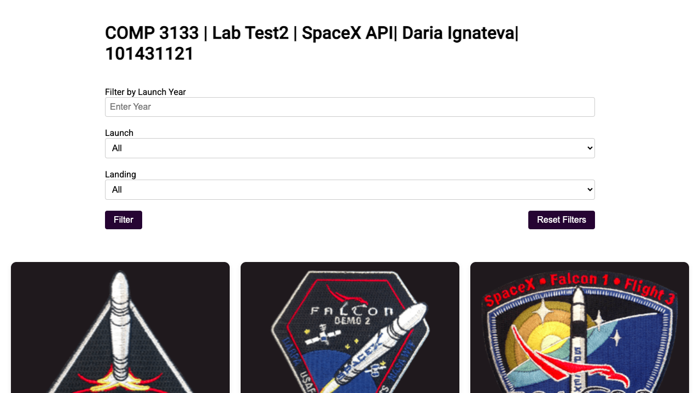
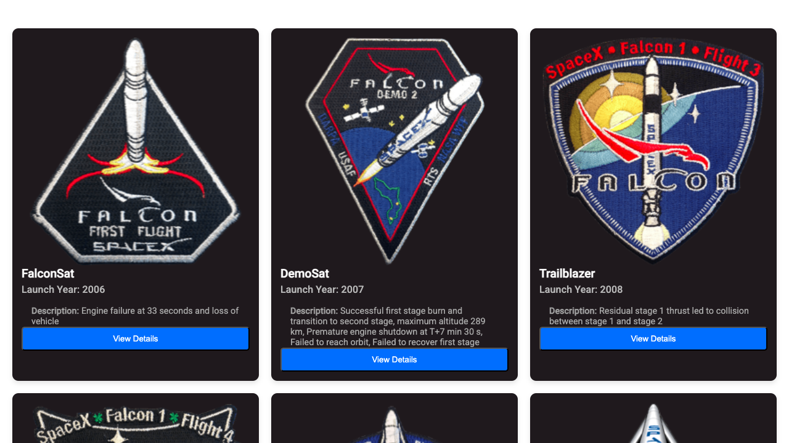
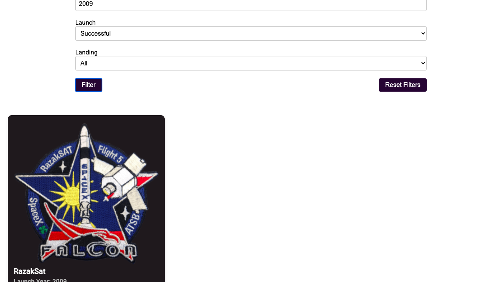
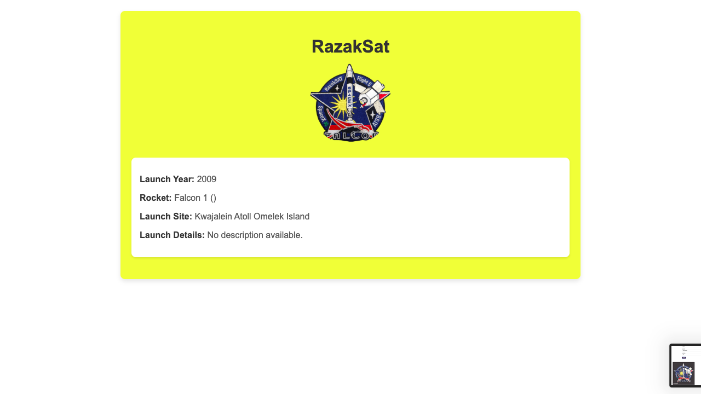

# 🚀 SpaceX Launch Explorer  
**COMP 3133 – Full Stack Development II – Lab Test 2**  
**By: Daria Ignateva (101431121)**  

This is an **Angular application** that displays **SpaceX launch missions** using the SpaceX API. Users can **filter launches** based on year, launch success, and landing success, and **view detailed mission information**.

## 🌟 Features
- **View All SpaceX Missions** with launch year, success status, and rocket details.  
- **Filter Missions** based on launch year, launch success, and landing success.  
- **View Detailed Information** about each mission, including mission patch, launch site, and failure details.  
- **Modern UI** built with **Angular Material**.  
- **Deployed on Vercel** for easy access.  

---

## 📸 Screenshots






---

## 🛠️ Tech Stack
- **Frontend**: Angular, Angular Material  
- **Backend API**: [SpaceX API](https://api.spacexdata.com/v3/launches)  
- **Deployment**: Vercel  

---

## 🚀 Setup & Installation

### 1️⃣ **Clone the repository**
```bash
git clone https://github.com/dorpanz/101431121-lab-test2-comp3133.git
cd your-repo-name
```

### 2️⃣ **Install dependencies**
```bash
npm install
```

### 3️⃣ **Run the app locally**
```bash
ng serve
```
Then, open `http://localhost:4200/` in your browser.

### 4️⃣ **Build for production**
```bash
ng build --configuration=production
```

### 5️⃣ **Deploy on Vercel**
```bash
vercel --prod
```

---

## 📂 Project Structure
```
/src
  ├── app/
  │   ├── mission-list/  --> Displays the list of SpaceX launches
  │   ├── mission-details/  --> Shows details of a specific mission
  │   ├── services/  --> Fetches data from SpaceX API
  │   ├── app.routes.ts  --> Configures Angular routes
  │   ├── app.component.ts  --> Main entry component
  ├── assets/
  ├── styles.css  --> Global styles
  ├── main.ts  --> Application bootstrap
  ├── index.html  --> App entry point
  ├── angular.json  --> Angular configuration
  ├── package.json  --> Dependencies and scripts
```


## 🌐 Live Demo  
🔗 **[Live App on Vercel](https://101431121-lab-test2-comp3133.vercel.app/)**  

---
